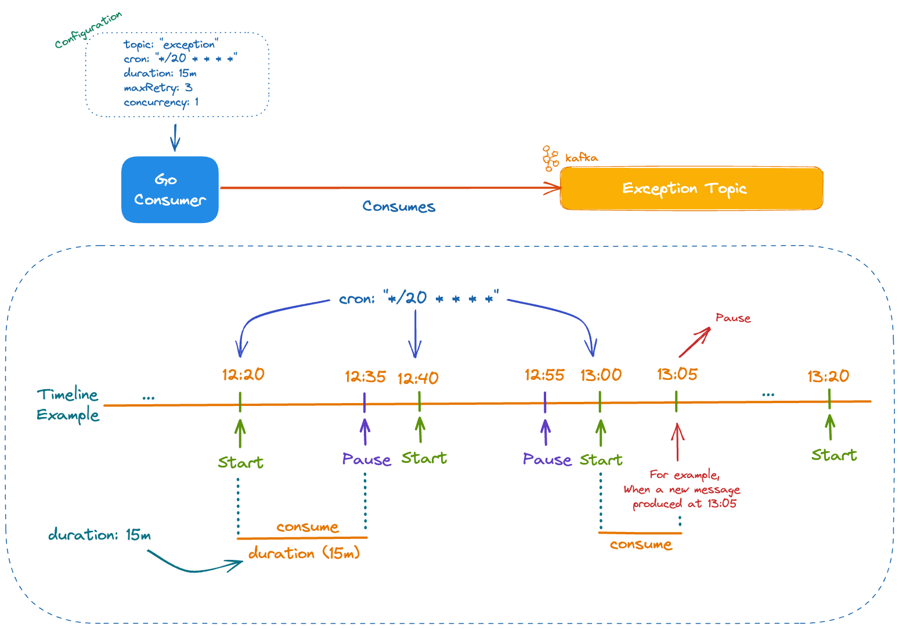

# 🔥 Kafka C[r]onsumer 🔥

# Description 📖

Kafka Cronsumer is mainly used for retry/exception strategy management.
It works based on cron expression and consumes messages in a timely manner
with the power of auto pause and concurrency configurations.

[For details check our blog post]()

# Architecture and How Kafka Cronsumer Works 💡



# 🖥 Use cases

TODO

# Guide

### Installation 🧰

```sh
TODO
```

## Examples 🛠

You can find a number of ready-to-run examples at [this directory](example).

### Single Consumer

```go
package main

import (
	"fmt"
	"kafka-cronsumer"
	"kafka-cronsumer/internal/config"
	"kafka-cronsumer/log"
	"kafka-cronsumer/model"
)

func main() {
	applicationConfig, err := config.New("./example/single-consumer", "config")
	if err != nil {
		panic("application config read failed: " + err.Error())
	}

	var consumeFn kafka_cronsumer.ConsumeFn = func(message model.Message) error {
		fmt.Printf("Consumer > Message received: %s\n", string(message.Value))
		return nil
	}

	cronsumer := kafka_cronsumer.NewKafkaCronsumer(applicationConfig.Kafka, consumeFn, log.DebugLevel)
	cronsumer.Run(applicationConfig.Kafka.Consumer)
}
```

### Single Consumer With Dead Letter

```go
package main

import (
	"errors"
	"fmt"
	"kafka-cronsumer"
	"kafka-cronsumer/internal/config"
	"kafka-cronsumer/log"
	"kafka-cronsumer/model"
)

func main() {
	applicationConfig, err := config.New("./example/single-consumer-with-deadletter", "config")
	if err != nil {
		panic("application config read failed: " + err.Error())
	}

	var consumeFn kafka_cronsumer.ConsumeFn = func(message model.Message) error {
		fmt.Printf("Consumer > Message received: %s\n", string(message.Value))
		return errors.New("error occurred")
	}

	cronsumer := kafka_cronsumer.NewKafkaCronsumer(applicationConfig.Kafka, consumeFn, log.DebugLevel)
	cronsumer.Run(applicationConfig.Kafka.Consumer)
}
```

### Multiple Consumers

```go
package main

import (
	"kafka-cronsumer"
	"kafka-cronsumer/internal/config"
	"kafka-cronsumer/log"
	"kafka-cronsumer/model"

	"fmt"
)

func main() {
	first := getConfig("config-1")
	var firstConsumerFn kafka_cronsumer.ConsumeFn = func(message model.Message) error {
		fmt.Printf("First Consumer > Message received: %s\n", string(message.Value))
		return nil
	}
	firstHandler := kafka_cronsumer.NewKafkaCronsumer(first.Kafka, firstConsumerFn, log.DebugLevel)
	firstHandler.Start(first.Kafka.Consumer)

	second := getConfig("config-2")
	var secondConsumerFn kafka_cronsumer.ConsumeFn = func(message model.Message) error {
		fmt.Printf("Second Consumer > Message received: %s\n", string(message.Value))
		return nil
	}
	secondHandler := kafka_cronsumer.NewKafkaCronsumer(second.Kafka, secondConsumerFn, log.DebugLevel)
	secondHandler.Start(first.Kafka.Consumer)

	select {} // block main goroutine (we did to show it by on purpose)
}

func getConfig(configName string) *config.ApplicationConfig {
	cfg, err := config.New("./example/multiple-consumers", configName)
	if err != nil {
		panic("application config read failed: " + err.Error())
	}
	cfg.Print()
	return cfg
}
```

# Configs

| config        | description                                                  | example                  |
|---------------|--------------------------------------------------------------|--------------------------|
| `cron`        | Cron expression when exception consumer starts to work at    | */1 * * * *              |
| `duration`    | Work duration exception consumer actively consuming messages | 20s, 15m, 1h             |
| `maxRetry`    | Maximum retry value for attempting to retry a message        | 3                        |
| `concurrency` | Number of goroutines used at listeners                       | 1                        |
| `topic`       | Exception topic names                                        | exception-topic          |
| `groupId`     | Exception consumer group id                                  | exception-consumer-group |

## Contribute

**Use issues for everything**

- For a small change, just send a PR.
- For bigger changes open an issue for discussion before sending a PR.
- PR should have:
    - Test case
    - Documentation
    - Example (If it makes sense)
- You can also contribute by:
    - Reporting issues
    - Suggesting new features or enhancements
    - Improve/fix documentation

Please adhere to this project's `code of conduct`.

## Users

- [@Abdulsametileri](https://github.com/Abdulsametileri) (Author)
- [@emreodabas](https://github.com/emreodabas) (Author)

## Code of Conduct

[Contributor Code of Conduct](CODE-OF-CONDUCT.md). By participating in this project you agree to abide by its terms.

# Libraries Used For This Project 💪

✅ [segmentio/kafka-go](https://github.com/segmentio/kafka-go)

✅ [robfig/cron](https://github.com/robfig/cron)

# Additional References 🤘

✅ [Kcat](https://github.com/edenhill/kcat)

✅ [jq](https://stedolan.github.io/jq/)

✅ [Golangci Lint](https://github.com/golangci/golangci-lint)

✅ [Kafka Console Producer](https://kafka.apache.org/quickstart)
